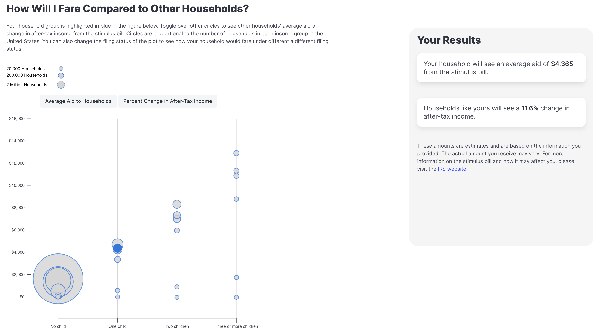

# Helping Households Determine Their Aid
### An interactive webpage to estimate and compare household stimulus aid amount

### By: Livia Mucciolo

[Link to webpage](https://lmucciolo.github.io/stimulus_aid_interactive_viz/)

## Project Description

This webpage provides an interactive interface where users can see the average 
amount of aid they can expect from the March 2021 stimulus bill (formally know as
the American Rescue Plan, or ARP), as well as an 
interactive figure to compare themselves with other types of households. Readers 
input three variables: annual household income, filing status, and number of
children (or dependents) and get results of their estimated average aid amount
and percent change in after-tax income. The results are shown numerically 
and visually in a figure where the reader can compare their results with other
household groups. This project is a reimagination of a New York Times UpShot
[article](https://www.nytimes.com/2021/03/12/upshot/stimulus-bill-money-families.html)
featuring the same data. Overall the goal was to reinterpret the visualizations 
in the NYT article, as well as add an interactive component. While the ARP was 
signed years ago, and the effects of the pandemic have diminished, 
I hope to use this exercise to rethink how to display tax data in a way that 
viewers can actively engage with. 

## Screenshot Sample

## Data Sources
The data used was graciously provided by my previous employer, the Tax Policy Center
at the Urban Institute. For more information on their March 2021 stimulus bill
estimates please visit their website [here](https://taxpolicycenter.org/taxvox/tpc-releases-new-distributional-analysis-pandemic-relief-bill).
