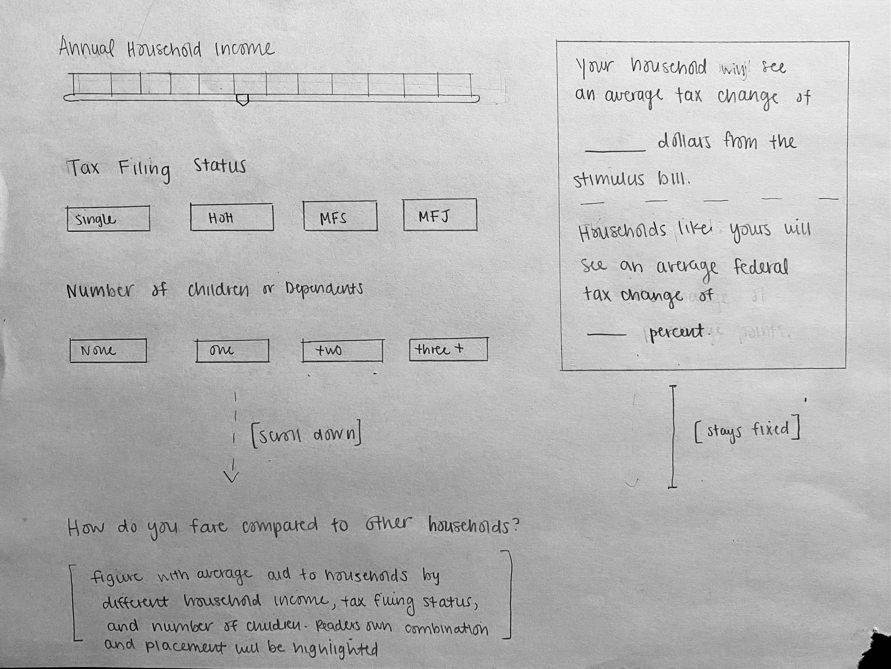

## Stimulus Aid Interactive Data Visualization

#### By: Livia Mucciolo

### Description

In March 2021, President Biden proposed and signed the American Rescue Plan (ARP), one of the largest COVID-19 relief acts. The ARP legislation substantially raised the child tax credit from $2,000 to $3,000 per child and made it fully refundable for 2021 (prior, it was only refundable up to $1,400 per child). The ARP also provided families $1,400 in stimulus payments for any individual or dependent. 
Alongside the goal of pandemic relief to the economy and households, the ARP was expected to cut child poverty in half in 2021. 

When the ARP was proposed, I was working in Washington DC at the Urban-Brookings Tax Policy Center as a research assistant. My job included analyzing tax bills and their respective effects on the American population. Right after President Biden announced the bill, TPC received a request from a journalist at the New York Times asking for a distributional analysis of the major tax provisions in the bill by household size, type, and income. Using our in-house tax microsimulation model we produced the requested numbers, which were published in an [UpShot article](https://www.nytimes.com/2021/03/12/upshot/stimulus-bill-money-families.html). 

For this project, I aim to reimagine the visualizations in the NYT article, as well as add an interactive component. While the ARP was signed years ago, and the effects of the pandemic have diminished, I hope to use this exercise to rethink how to display tax data in a way that viewers can actively engage with. 

### Data Sources
The data I produced in 2021 for the NYT was graciously provided to me by my previous employer. It comprises two excel spreadsheets with different tabs/tables for the different types of households and number of children. They have requested I do not publish the raw data as it goes into more detail than the typical estimates they publicly release [(see example here)](https://taxpolicycenter.org/model-estimates/american-rescue-plan-act-2021-final-version-passed-senate-and-house-march-2021/t21-0).

### Guiding Examples

* [How Much Hotter is your Hometown?](https://www.nytimes.com/interactive/2018/08/30/climate/how-much-hotter-is-your-hometown.html):
I like this visualization both because the visualization is tailored to the reader's personalized input, and because it shows the greater scope of an issue using the reader's input as a comparison. For my own project I'd like to use the search/drop-down bars to potentially allow readers to choose their income level or household type/number of children and then have a chart or figure autopopulate how much money they would receive from the stimulus bill. I think it would be interesting to add a figure that shows them compared to other households and where they fall in the range of average stimulus amounts (something close to the static visualization the original NYT article provides). I think this example would best fit as Option A (core interative).

* [Is It Better to Rent or Buy? A Financial Calculator](https://www.nytimes.com/interactive/2024/upshot/buy-rent-calculator.html):
Similar to the example above, I like how this one requires the reader to actively input information and then in real-time provides interactive output. I think this a good example of having multiple input variables. For my own data I would have household type, number of children, and household income as key inputs, so I would definitely require a way to gather all three values seamlessly. I like how in the example they used a sliding scale. The output is also a numerical value which is similar to what I would like to include in my visualization (i.e, average size of stimulus aid). I think this approach includes a mixture of interactive techniques, and would best fit as Option C (custom option).
  
### Mock-up Image

### Questions
1. What is the best way to go about keeping the data private?
2. Given that the ARP was enacted over three years ago, should I try to supplement my project with more current information on its effects? 

